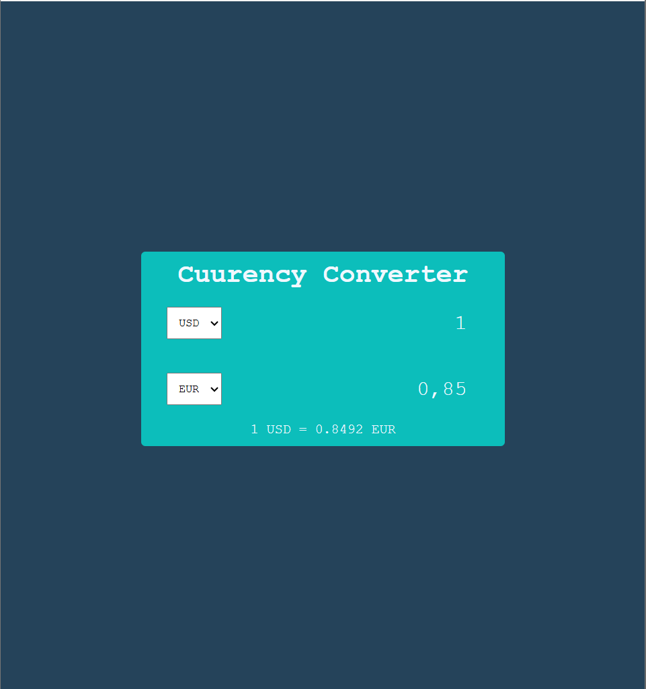

# 💱 Currency Converter Web App

A simple and responsive Currency Converter built using **HTML, CSS, and JavaScript**.  
This project fetches real-time exchange rates using an external API and converts currencies instantly.

## 🚀 Features
- 🌍 Real-time currency conversion
- 🔄 Automatic conversion when amount changes
- 📊 Live exchange rate display
- 💻 Clean and responsive UI
- ⚡ Built with pure JavaScript (No frameworks)

## 🛠️ Technologies Used
- HTML5
- CSS3
- JavaScript (Vanilla JS)
- ExchangeRate API
---

## 📂 Project Structure
```
Currency-Converter/
│
├── index.html
├── style.css
├── script.js
└── README.md
```

---

## ⚙️ How It Works

1. User selects the base currency.
2. User selects the target currency.
3. JavaScript fetches the latest exchange rate from the API.
4. The converted amount updates automatically.
5. The exchange rate is displayed below the input fields.

## 🔌 API Used
ExchangeRate API

Example endpoint format:
```
https://v6.exchangerate-api.com/v6/YOUR_API_KEY/latest/USD
```

⚠️ Note:  
If the API key stops working, generate your own free API key from:  
https://www.exchangerate-api.com/

## ▶️ How to Run the Project

1. Download or clone the repository:
```
git clone https://github.com/yourusername/currency-converter.git
```
2. Open the project folder.
3. Open `index.html` in your browser.
No installation required.

## 🖼️ Screenshot



## 🎯 What I Learned
- DOM Manipulation
- Fetch API usage
- Handling JSON data
- Event Listeners
- API integration in frontend projects

## 📌 Future Improvements
- Add swap currency button
- Add loading animation
- Add error handling
- Add currency flags
- Convert to React version

## 👨‍💻 Author

Takundah Gorogodo  
CSE Student | Machine Learning Enthusiast  

## 📄 License

This project is open-source and available for learning and educational purposes.
